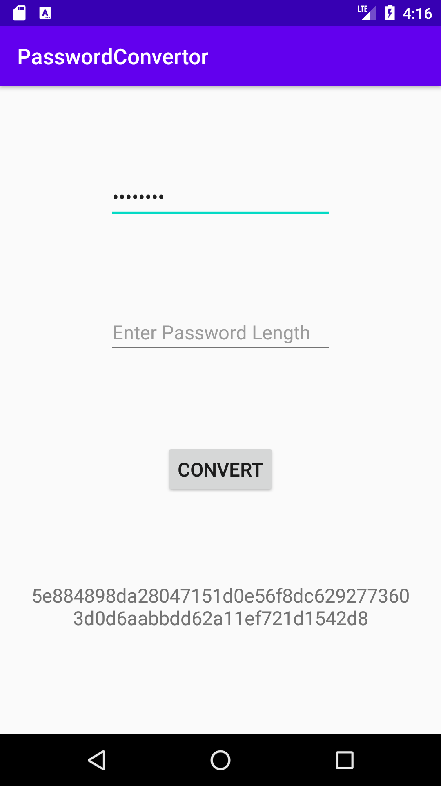

# PasswordConvertor for android
Convert password by SHA-256

## DEMO

## Requirement
- Android Gradle Plugin Version

## Usage
1. Enter password.
1. Press CONVERT button
1. Output converted password.

## Author
- Masapyon (@ocucraqp)

## LICENSE

[MIT](http://opensource.org/licenses/MIT)